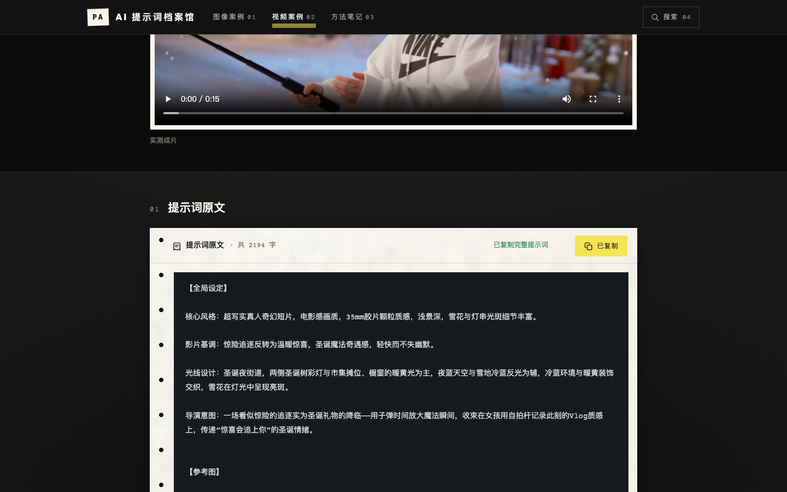
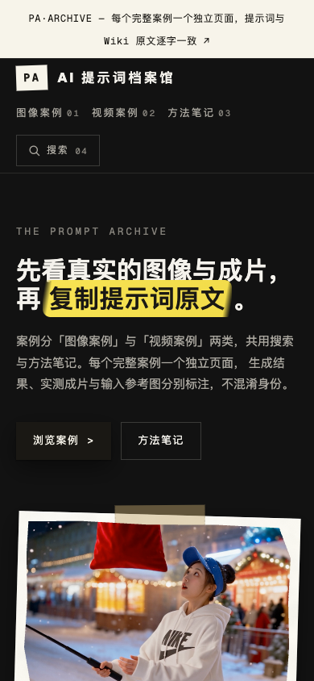

# AI 提示词档案馆

面向公众的 AI 图像与视频提示词案例静态网站：每个完整案例一个独立页面，提示词保持 Wiki 原文，
生成结果、实测成片与输入参考图分别标注。规划与设计文档见 `docs/`。

## 页面截图

截图来自本地预览，展示首页、案例检索、案例详情、提示词复制与手机布局。

### 首页（桌面）


### 案例检索


### 案例详情


### 提示词复制



### 首页（手机）



## 常用命令

```bash
npm install            # 安装依赖
npm run dev            # 开发预览（http://localhost:4321）
npm test               # 运行测试（原文抽取 / 链接解析 / 导出与公开门禁）
npm run build          # 默认 preview 模式：导出 Wiki 内容 + 构建静态站点到 dist/
SITE_MODE=public npm run build   # 公开门禁模式：仅导出获准条目，并压缩视频到 720p H.264 MP4
npm run build:pages    # 公开构建 + 生成适配 GitHub Pages 项目路径的 pages-dist/
npm run preview        # 预览 dist/（需先 build）
```

环境变量：`WIKI_ROOT`（默认 `/Users/zhiguang/wiki`）。公开构建需安装 `ffmpeg`；
首次构建会转码视频，后续复用 `.cache/media/` 中以源内容哈希命名的压缩副本。
原始 Wiki 视频与图片不被修改；图片目前保持原格式，以免降低含文字的截图清晰度。
`src/generated/report.json` 的 `mediaBytes` 记录原始和导出的媒体体积。
本仓库不包含 Wiki 原文、导出的内容与媒体文件；本地构建需要另行提供 `WIKI_ROOT` 指向的源资料。

## GitHub Pages 发布

发布源为 `gh-pages` 分支的根目录，内容取自本机 `npm run build:pages` 生成的 `pages-dist/`。
源码仓库不包含 Wiki 原文，GitHub Actions 无法独立重建完整站点；更新内容时需要在有 Wiki
源资料的本机重新构建并更新发布分支。`pages-dist/` 和转码缓存均不提交到 `main`。

## 目录结构

| 路径 | 说明 |
| --- | --- |
| `content/catalog.json` | 网站编辑清单：案例/笔记/合集的 slug、来源、媒体与公开审核状态 |
| `scripts/lib/source.mjs` | 源 Markdown 读取与围栏原文逐字抽取 |
| `scripts/lib/wiki-links.mjs` | Obsidian 文档链接与媒体引用解析 |
| `scripts/lib/export.mjs` | 依据清单导出案例、笔记、媒体与报告 |
| `src/generated/` | 导出产物（不手改）：cases/notes/collections JSON、转换后的笔记、report.json |
| `public/media/` | 通过校验的媒体副本（内容哈希命名，不手改） |
| `src/pages/`、`src/components/` | Astro 页面与组件 |
| `docs/content-review.md` | 首批内容公开审核记录 |

## 公开审核

`content/catalog.json` 中每条 `approvedForPublic` 对应 `docs/content-review.md` 的逐项记录。
`SITE_MODE=public` 构建只包含获准条目，未审核条目（如关联转载受限资料的变量库）自动排除并
记入 `src/generated/report.json`。GitHub 仓库公开不代表网站已部署。
